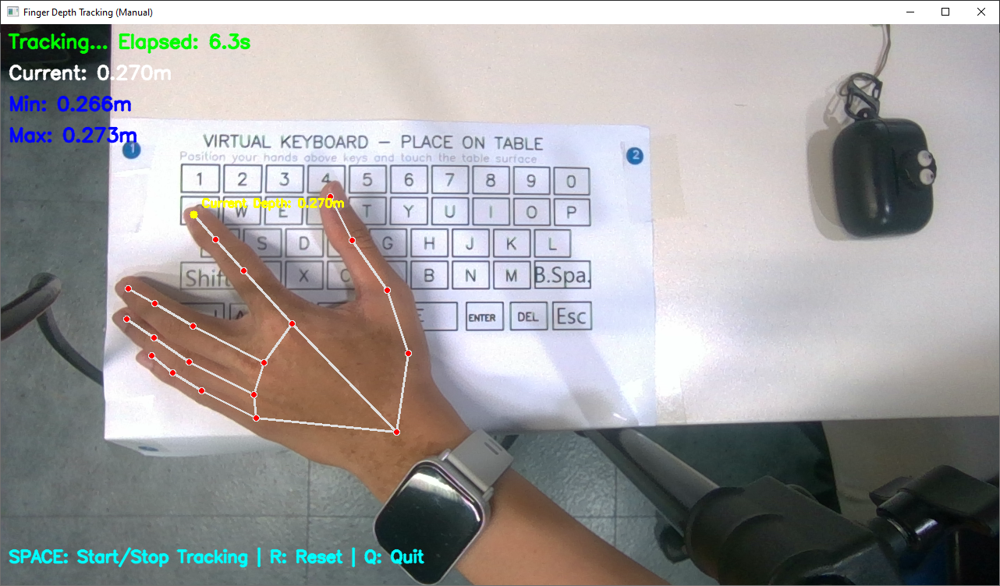

# Virtual Keyboard Interface

A computer vision-based virtual keyboard interface that uses depth sensing and hand tracking to detect keypresses in 3D space. The system utilizes a RealSense depth camera and MediaPipe for hand tracking to create a virtual typing experience.

## Features

- Real-time hand tracking with MediaPipe
- Depth-based keypress detection using Intel RealSense camera
- Multi-finger tracking support (thumb, index, middle, ring, and pinky)
- Visual feedback system for finger positions and keypresses
- Configurable depth thresholds for different keyboard rows
- Support for special keys (ENTER, SPACE, DELETE)
- Real-time text display of typed content
- Interactive keyboard annotation tool


## Requirements

- Python 3.10.11
- Intel RealSense Camera
- Dependencies:
  - opencv-python
  - numpy
  - mediapipe
  - pyrealsense2

## Project Structure

The project consists of several key components:

- `main.py`: Core application entry point and keyboard interface implementation
- `camera_manager.py`: RealSense camera initialization and frame capture handling
- `hand_tracker.py`: MediaPipe-based hand landmark detection and tracking
- `keyboard_manager.py`: Keyboard layout and key detection management
- `visualization_utils.py`: Visual feedback and display utilities
- `depth_tracker.py`: Depth tracking and threshold management

## Configuration

The system uses the following key configurations:

### Keyboard Layout


## Usage
### Setup Environment
1. Clone the repository
    ```bash
    git clone https://github.com/nhhsag12/camera-based_keyboard.git
    ```

2. Create a virtualenv and install the requirements
    ```bash
   cd camera-based_keyboard
   python -m venv .venv
   source .venv/bin/active
   pip install -r requirements.txt 
   ```
### Keyboard Annotation Tools
1. Start the annotation tool:
    ```bash
   python keyboard_annotation.py 
   ```
2. Controls:
   - `c`: Capture current frame for annotation
   - `Mouse clicks`: Place points for key corners (4 points per key)
   - `+`/`-`: Zoom in/out for precise point placement
   - Pan the zoomed view
     - `;`: Move up
     - `,`: Move left
     - `.`: Move down
     - `/`: Move right
   - `r`: Reset zoom and pan
   - `s`: Save annotations to JSON file
   - `q`: Quit the program
   - 

3. Annotation Process:
   - Capture a clear frame of the keyboard using 'c'
   - for each key:
    1. Click 4 corner points
   2. Enter the key value
   3. Confirm to save the key annotation
    - Use zoom/pan as needed for accurate point placement
    - Save progress periodically using 's'

### Create Depth Threshold for Each Keycap
1. Start the depth tracker tool

    ```bash
    python depth_tracker.py
    ```
   
2. Place your index finger each keycap in a period of time
    
3. Save your result in the `assets/key_thresholds.json` file

- Save the thresholds (min and max depth of the fingertip when press keycap) of each keycap
- Examples:
    ```json
    {
        "1": [0.264, 0.275],
        "2": [0.264, 0.276],
        "3": [0.265, 0.280],
        "4": [0.270, 0.280],
        "5": [0.270, 0.281],
        "6": [0.272, 0.282],
        "7": [0.275, 0.281],
        "8": [0.277, 0.282],
        "9": [0.276, 0.284],
        "0": [0.276, 0.284],
        "q": [0.265, 0.275],
        "w": [0.265, 0.275],
        "e": [0.270, 0.278],
        "r": [0.265, 0.280],
        "t": [0.270, 0.281],
        "y": [0.272, 0.282],
        "u": [0.273, 0.284],
        "i": [0.272, 0.283],
        "o": [0.275, 0.285],
        "p": [0.275, 0.288],
        "a": [0.265, 0.278],
        "s": [0.265, 0.278],
        "d": [0.268, 0.276],
        "f": [0.268, 0.280],
        "g": [0.270, 0.280],
        "h": [0.270, 0.281],
        "j": [0.274, 0.283],
        "k": [0.275, 0.283],
        "l": [0.275, 0.284],
        "SHIFT": [0.267, 0.275],
        "z": [0.268, 0.278],
        "x": [0.268, 0.279],
        "c": [0.268, 0.280],
        "v": [0.268, 0.281],
        "b": [0.270, 0.282],
        "n": [0.272, 0.282],
        "m": [0.274, 0.282],
        "BACKSPACE": [0.276, 0.283],
        "CTRL": [0.265, 0.275],
        "ALT": [0.264, 0.275],
        "WIN": [0.269, 0.280],
        "SPACE": [0.265, 0.280],
        "ENTER": [0.271, 0.281],
        "DEL": [0.272, 0.283],
        "ESC": [0.274, 0.283]
    }
    ```

### Main Program
1. Ensure your RealSense camera is connected
2. Run the main script:
   ```bash
   python main.py
   ```
3. Position your hand and paper-based keyboard above the virtual keyboard area

4. Move your fingers to type:
   - Keys are activated when fingers reach the appropriate depth threshold
   - Visual feedback shows detected finger positions and active keys
   - Typed text appears in real-time on the display

## Key Features Implementation

### Annotation Tool features
the tool saves annotations in JSON format:
```json
{
    "key": "0",
    "points": [
        {
            "x": 189,
            "y": 292
        },
        {
            "x": 185,
            "y": 312
        },
        {
            "x": 212,
            "y": 314
        },
        {
            "x": 215,
            "y": 294
        }
    ]
}
```
Eeach key annotation contains:
- `key`: The character of special key name
- `points`: Array of 4 corner coordinates

### Depth Tracking Features
- Utilizes RealSense depth camera capabilities
- Configurable depth thresholds per keycap

**I used this tools to create threshold for each keycap**

### Hand Tracking
The system tracks five finger positions:
- Thumb
- Index finger
- Middle finger
- Ring finger
- Pinky finger

Each finger's position and depth are monitored for potential keypresses.

### Keypress Detection
A keypress is registered when:
1. The finger position overlaps with a key's boundary
2. The finger's depth matches the specific keycap's depth threshold

### Visual Feedback
The interface provides:
- Real-time hand landmark visualization
- Depth information for each tracked finger
- Highlighted keys when pressed
- Current detected key display
- Continuous display of typed text

## Exiting the Application
Press 'q' to quit the application.

## Notes
- Proper lighting conditions are recommended for optimal hand tracking
- Calibration of depth thresholds may be necessary for different setups
- The system is designed for single-hand operation

## Future Improvements
- [x] Multi-finger support
- [ ] Automatic keyboard layout detection
- [ ] Enhance accuracy
- [ ] Support for additional special characters

# Demo

