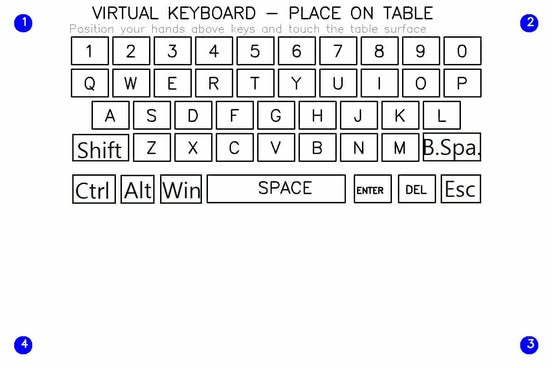

# Virtual Keyboard Interface

A computer vision-based virtual keyboard interface that uses depth sensing and hand tracking to detect keypresses in 3D space. The system utilizes a RealSense depth camera and MediaPipe for hand tracking to create a virtual typing experience.

## Features

- Real-time hand tracking with MediaPipe
- Depth-based keypress detection
- Support for multiple keyboard rows with different depth thresholds
- Visual feedback for finger positions and key presses
- Support for special keys (ENTER, SPACE, DELETE)
- Real-time text display of typed content

## Requirements

- Python 3.10.11
- Intel RealSense Camera
- Dependencies:
  - opencv-python
  - numpy
  - mediapipe
  - pyrealsense2

## Project Structure

The project consists of several key components:

- `camera_manager.py`: Handles RealSense camera initialization and frame capture
- `hand_tracker.py`: Implements hand landmark detection using MediaPipe
- `visualization_utils.py`: Contains utilities for visual feedback
- `keyboard_manager.py`: Manages keyboard layout and key detection
- `main.py`: Main application loop and keyboard interface implementation

## Configuration

The system uses the following key configurations:

### Keyboard Layout

- 5 rows of keys:
  - Row 1: Numbers (0-9)
  - Row 2: QWERTYUIOP
  - Row 3: ASDFGHJKL
  - Row 4: ZXCVBNM
  - Row 5: Special keys (DEL, SPACE, ENTER)

### Depth Thresholds 

The lowerbound and upperbound of each row's depth

```python
DEPTH_THRESHOLD_ROW_1 = (0.285, 0.304) 
DEPTH_THRESHOLD_ROW_2 = (0.295, 0.311) 
DEPTH_THRESHOLD_ROW_3 = (0.305, 0.318) 
DEPTH_THRESHOLD_ROW_4 = (0.310, 0.326) 
DEPTH_THRESHOLD_ROW_5 = (0.325, 0.335)
```


## Usage
1. Clone the repository
    ```bash
    git clone https://github.com/nhhsag12/camera-based_keyboard.git
    ```

2. Create a virtualenv and install the requirements
    ```bash
   cd camera-based_keyboard
   python -m venv .venv
   source .venv/bin/active
   pip install -r requirements.txt 
   ```
3. Ensure your RealSense camera is connected
4. Run the main script:
   ```bash
   python main.py
   ```
5. Position your hand and paper-based keyboard above the virtual keyboard area

6. Move your fingers to type:
   - Keys are activated when fingers reach the appropriate depth threshold
   - Visual feedback shows detected finger positions and active keys
   - Typed text appears in real-time on the display

## Key Features Implementation

### Hand Tracking
The system tracks five finger positions:
- Thumb
- Index finger
- Middle finger
- Ring finger
- Pinky finger

Each finger's position and depth are monitored for potential keypresses.

### Keypress Detection
A keypress is registered when:
1. The finger position overlaps with a key's boundary
2. The finger's depth matches the specific row's depth threshold

### Visual Feedback
The interface provides:
- Real-time hand landmark visualization
- Depth information for each tracked finger
- Highlighted keys when pressed
- Current detected key display
- Continuous display of typed text

## Exiting the Application
Press 'q' to quit the application.

## Notes
- Proper lighting conditions are recommended for optimal hand tracking
- Calibration of depth thresholds may be necessary for different setups
- The system is designed for single-hand operation

## Future Improvements
- Multi-finger support
- Automatic keyboard layout detection
- Enhance accuracy
- Support for additional special characters

# Demo

